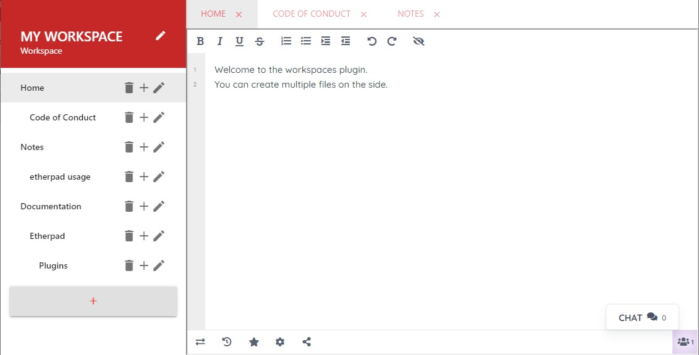

# Workspaces for Etherpad

A workspace editor for etherpad. 

- allows to edit multiple files in parallel using tabs
- allows to have a collection of pads in a file tree to organize more complex projects
- has mobile support so you can edit pads in your workspaces on the go

## Install it
To install PadWiki Simpy go to the admin interface of your etherpad-lite server
(located under `/admin/plugins`), search for `Workspaces` and install it.

Now you should be able to access workspaces by going to `example.com/w/` and using the buttons there. 